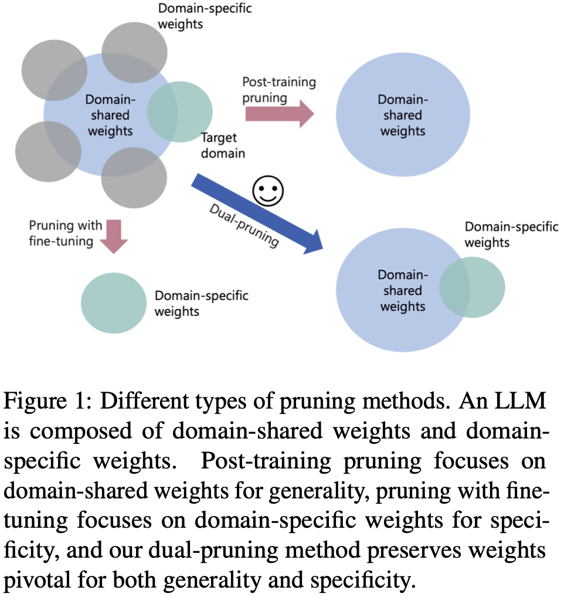

# D-Pruner
Code for 2024 NAACL Findings paper [Pruning as a Domain-specific LLM Extractor]().

Navigation:
[Overview](#overview), 
[Datasets](#datasets),
[Models and Experiments](#models-and-experiments),
[Acknowledgement](#acknowledgement),
[Citation](#citation)

## Overview
We introduce **D-Pruner**, an unstructured dual-pruning methodology for domain-specific compression on LLMs. It extracts a compressed, domain-specific, and task-agnostic LLM by identifying LLM weights that are pivotal for general capabilities, like linguistic capability and multi-task solving, and domain-specific knowledge. It assesses general weight importance by quantifying the error incurred upon their removal with the help of an open-domain calibration dataset. Then, it utilizes this general weight importance to refine the training loss, so that it preserves generality when fitting into a specific domain. By efficiently approximating weight importance with the refined training loss on a domain-specific calibration dataset, we obtain a pruned model emphasizing <ins>generality</ins> and <ins>specificity</ins>. Here <ins>generality</ins> refers to the general capabilities of an LLM when applied to domain-specific challenges such as language understanding and generation, and multi-task solving, and <ins>specificity</ins> refers to the capability of an LLM to understand domain-specific knowledge.

<p align="center">
	
</p>


## Datasets
We perform model traning on a variety of datasets cross medical and legal domains. In medical domain, we perform perplexity evaluation on a medical textbook called InternalMed_Harrison provided by the [MedQA](https://sites.google.com/view/mediqa2021). We also used [MedNLI](https://jgc128.github.io/mednli/), [PubMedQA](https://pubmedqa.github.io/), and [Health Quesiton Summarization](https://sites.google.com/view/mediqa2021#h.4zsdlej0tllb) datasets for fine-tuning (with pruning) and evaluation to test the multi-task solving capabilities of a pruned LLM. We are not allowed to share some of these datasets due to legal concerns, so we recommed to collect them by yourself by completing user agreement. For reproducibility, we release the importance scores of LLaMA2-7B by D-Pruner [here](https://pennstateoffice365-my.sharepoint.com/:u:/g/personal/njz5124_psu_edu/EbhBuV1x0o5EiXRM1beXuU8BUDztvDBYyanFCRLvEAXlKQ?e=jgVMN6).

In legal domain, we collected 300 instances from MultiLegalPile dataset for perplexity evaluation. We also used [CaseHOLD](https://github.com/reglab/casehold) and [BillSum](https://github.com/FiscalNote/BillSum). The processed version of all three datasets are in [legal_pruning_data](/code/legal_pruning_data) folder.

## Models and Experiments
First of all, install all required Python packages with `pip install -r requirements.txt`. In order to obtain general weight importance score for generality (at 50% sparsity on LLaMA2-7b), run the command below:

    python code/general.py LLaMA2_HF_LOCATION c4 --sparsity 0.52

You will get general weight importance score that corresponds to individual weight of LLaMA2. Then, to perform fine-tuning with pruning via D-Pruner for specificity, run the command below:

    deepspeed --master_port 6006 code/src/train_lomo.py config/args_lomo.yaml

Before you run this fine-tuning pipeline, remember to specify `model_name_or_path` as your model path and select `domain` as either "medical" or "legal" in [this file](/code/config/args_lomo.yaml). You might need to modify or tune other parameters based on the model of your choice (e.g., you are using the 13b version of LLaMA2 instead of 7b) and other experimental settings. Final importance scores are saved for model pruning. To actually prune the LLaMA2-7b model, use commands:
```
# with iterative blocking
python code/save_model_iterative.py LLaMA2_HF_LOCATION IMPORTANCE_LOCATION OUTPUT_LOCATION

# without iterative blocking
python code/save_modelpy LLaMA2_HF_LOCATION IMPORTANCE_LOCATION OUTPUT_LOCATION

```
You will be able to save the pruned model by specifying `OUTPUT_LOCATION`. If you are working with the 13b or 70b version of LLaMA2, it is necessary to adjust the numbers for threshold computation due to different model architectures.


To perform model evaluation, use commands:

```
# For perplexity evaluation
python code/legal_perplexity_evaluation.py LLaMA2_HF_LOCATION PRUNED_MODEL_LOCATION

# For classification evaluation
python code/test_casehold.py LLaMA2_HF_LOCATION PRUNED_MODEL_LOCATION

# For summarization evaluation
python code/test_billsum.py LLaMA2_HF_LOCATION PRUNED_MODEL_LOCATION

```
Evaluation code of the medical datasets will be similar to the provided code of legal datasets.


## Acknowledgement
* Our code for computing general weight importance is developed based on: https://github.com/IST-DASLab/sparsegpt.
* Our fine-tuning code is developed based on: https://github.com/OpenLMLab/LOMO.

## Citation
