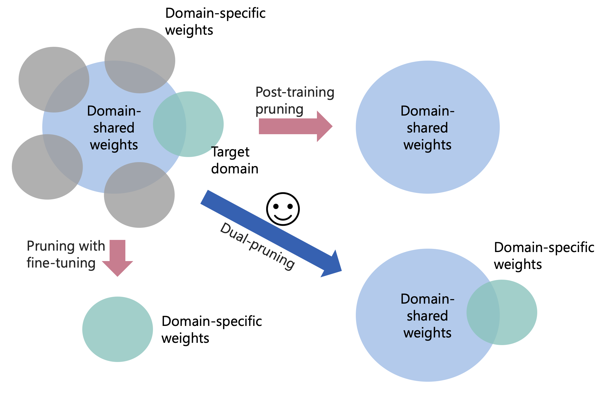

# D-Pruner
Code for 2024 NAACL Findings paper [Pruning as a Domain-specific LLM Extractor]().

Navigation:
[Overview](#overview), 
[Datasets](#datasets),
[Models and Experiments](#models-and-experiments),
[Acknowledgement](#acknowledgement),
[Citation](#citation)

## Overview
We introduce **D-Pruner**, an unstructured dual-pruning methodology for domain-specific compression on LLMs. It extracts a compressed, domain-specific, and task-agnostic LLM by identifying LLM weights that are pivotal for general capabilities, like linguistic capability and multi-task solving, and domain-specific knowledge. It assesses general weight importance by quantifying the error incurred upon their removal with the help of an open-domain calibration dataset. Then, it utilizes this general weight importance to refine the training loss, so that it preserves generality when fitting into a specific domain. By efficiently approximating weight importance with the refined training loss on a domain-specific calibration dataset, we obtain a pruned model emphasizing <ins>generality</ins> and <ins>specificity</ins>. Here <ins>generality</ins> refers to the general capabilities of an LLM such as language understanding and generation, and multi-task solving, and <ins>specificity</ins> refers to the capability of an LLM to understand domain-specific knowledge.

## Datasets

## Models and Experiments

## Acknowledgement

## Citation
